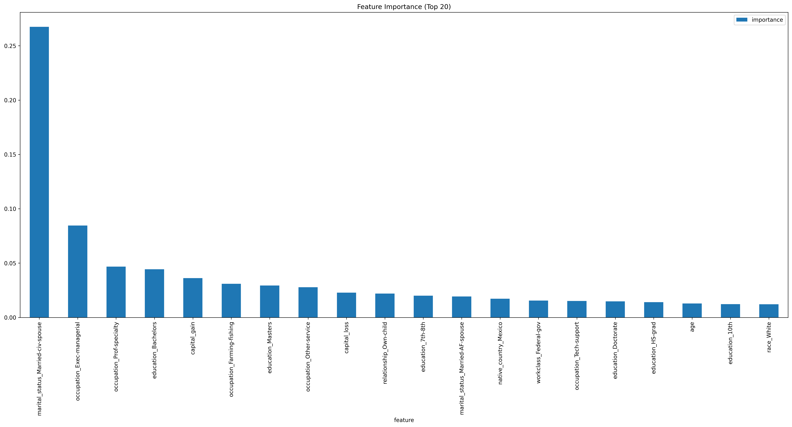
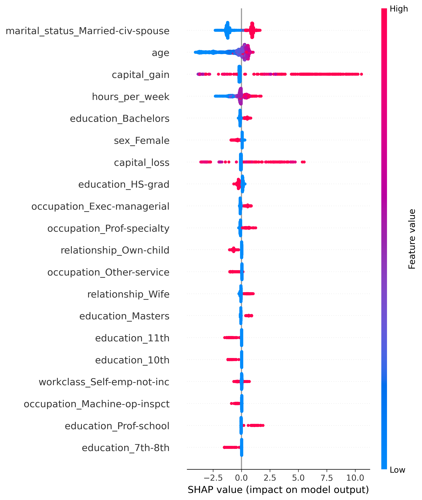

*"Who earns more — the graduate, the professional, or the self-employed? A machine learning exploration of income drivers."*

***Introduction***

Money influences the choices we make every day—what career path we choose, how long we stay in school, or whether we pursue self-employment.

As a Ghanaian fascinated by economics and how societies function, I wanted to explore a simple but important question:

👉 What truly drives income?

Is it education, as parents emphasize?
Is it occupation, as many people chase white-collar jobs?
Or does work type (government, private, or self-employed) play the biggest role?

To explore this, I used the well-known Adult Income Dataset, originally extracted from the 1994 U.S. Census by Barry Becker. The dataset contains 48,842 individuals, each labeled with whether they earn above or below $50K annually.

Although U.S.-based, I interpret this dataset as if it applied to Ghana, since many of the same drivers of income—education, occupation, and work type—remain relevant here and worldwide.

***Problem Statement***

This project explores the factors that influence whether someone earns above or below a given income threshold.

Some guiding questions were:

Education vs Income: Does higher education guarantee higher pay?

Occupation vs Income: Do certain jobs consistently pay more?

Education vs Occupation: Which has more impact—your degree or your career path?

Workclass vs Income: Do self-employed people earn more than government or private workers?

On a personal level, the model helps me reflect on decisions such as:

Should I focus on my education, because good grades and higher degrees secure better pay?

Or should I build my career and network early, since opportunities and connections may outweigh formal education?

Is self-employment more rewarding than government or private sector jobs?

***Dataset***

Source: UCI Adult Dataset (1994 Census) – Barry Becker’s extraction

Size: 48,842 rows (subset of U.S. population in 1994)

Target: Income ( >50K vs ≤50K )

Key Features Used:

Age, Education, Occupation, Workclass, Marital Status

Race, Sex, Native Country, Hours Worked per Week

Capital Gain, Capital Loss

***Methodology***

The workflow followed:

*Data cleaning & preprocessing*

Handle missing values (?) and obvious data issues

Scale numeric features and optionally expand with polynomial features for modelling experiments

*Encoding*

One-Hot Encoding for low-cardinality categorical features (for interpretability)

Target encoding for high-cardinality features where necessary (tradeoff: performance vs interpretability)

Note: For final interpretability (SHAP), a one-hot encoded pipeline was trained so SHAP outputs show concrete categories (e.g., occupation=Exec-managerial).

*Modeling*

Models tried: Logistic Regression, Decision Tree, Random Forest, XGBoost

Hyperparameter tuning via GridSearchCV with cross-validation

Primary evaluation metrics: Accuracy, Precision, Recall, F1, Log Loss; for final model also ROC-AUC and F1 (class-aware)

*Interpretation*

Global importance via feature importances of tree models

Local + global effects via SHAP (shows direction and magnitude per feature and per sample)

***Interpreting SHAP & feature importance — one clear rule***

Feature importance (bar chart): tells which features the model uses most often (global frequency of use).

SHAP (summary plot): tells how features move predictions (direction + magnitude) for individuals.

Short SHAP clarification for readers:
In SHAP plots, red = higher feature value, blue = lower feature value; the horizontal position shows whether that value pushes a prediction up (right) or down (left).

***Insights***
*EDUCATION*
*Findings* - Higher education shows a strong positive SHAP contribution towards earning >50K
Education matters - advanced degrees increase income potential but plateaus after a certain level (eg: beyond Master's Degree, the marginal gain is minimal). In essence, education improves pay, but it's not the only driver.

*OCCUPATION*
*findings*
Certain occupations consistenly push SHAP values upwards, meaning they increase chances of earning > 50K, in contrast, roles like Handlers-cleaners, Farming-fishing and Other-service push SHAP values downwards
- Therefore, career choice is a stronger determinant than just education. Someone with average education in the right occupation can out-earn a highly educated person in a low-paying occupation

*WORKCLASS*
*findings*
Workclass is not linear, but in summary, self employed individuals who run a structured, formalized business tend to earn higher than casual self-employed individuals. 
- Sophisticated self-employed individuals earn slightly higher than federal or state workers

*AGE*
- Income grows with age - the older the you are, the more likely you are to earn above 50K yearly.

*HOURS WORKED PER WEEK*
- The hours an individual spends on the job per week is also a positive contributor to income. In essence, if you spend more hours on the job, you most likely tend to earn above 50K

*CAPITAL GAIN*
- Capital gain also contributes to income but mostly reflects investments - those with significant capital gains almost always earn above 50K

Figure 1: Top 20 feature importance (XGBoost)

***BUSINESS AND PERSONAL INSIGHTS***
*FOR POLICY MAKERS* - Investing in education yields returns, but creating high-paying job opportunities matter more than just producing more graduates

*FOR BUSINESS* - Compensation programs should reward occupation-specific and experience-based skills, not only credentials. Training that targets occupational competencies (management, technical depth) delivers stronger ROI.

*ASPIRING ENTREPPRENEURS* - Formalizing a business (incorporation, scalable model) improves income prospects over informal self-employment.

***MY PERSONAL INSIGHTS***
- Education is valuable but occupation choice and practical skills matter more for income.
- If I pursue entrepreneurship, I’ll focus on formalizing the business and building financial literacy/investment strategies.
- Data science (my chosen path) is both occupation-sensitive and skill-heavy — a good match for income and growth potential.

*LIMITATIONS*

- The dataset is U.S.-based (1994). Applying results to Ghana is illustrative, not definitive.

- Features reflect correlation, not causation — SHAP explains model behavior, not causal effects.

- Income dynamics and job markets have changed since 1994; treat the analysis as structural insight rather than exact predictions.

In essence, education is important, but career choice is even more important. I choose to be a Data Scientist, with potential for growth in the future. 

***WISH ME LUCK!!!***

*Figure 3: SHAP summary plot — color = value (red=high, blue=low), horizontal position = effect on prediction.*